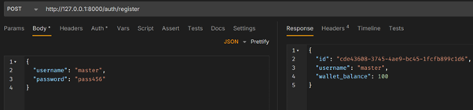

# FastAPI Backend with JWT Authentication & Virtual Wallet

A complete backend solution featuring a secure, modular, and scalable API using FastAPI that includes JWT-based user authentication, a virtual wallet system, and role-based access controls for administrators.

# Technologies Used

- Backend Framework: FastAPI
- Database: PostgreSQL (managed by Neon)
- ORM: SQLAlchemy
- Authentication: JWT (JSON Web Tokens) with Passlib & Argon2 for hashing
- Data Validation: Pydantic
- API Testing: Bruno

# User Authentication & Wallet
- User Registration:
 

- User Login: 
 

- Check Balance: 
 

# Item Purchasing & Transactions
- List Items: 
 

- Purchase Item: 
 

- Transaction History: 
 

- Insufficient Funds Validation: 
 

# Admin Features (Role-Based Access)
- Create Admin User: 
 

- Admin Add Item: 
 

- Admin: Credit Wallet: 
 